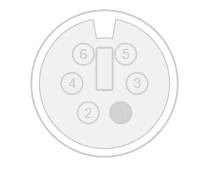
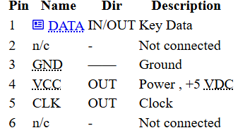
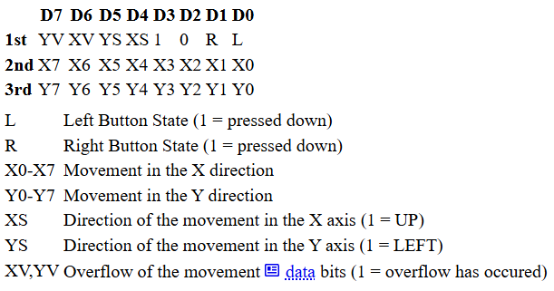
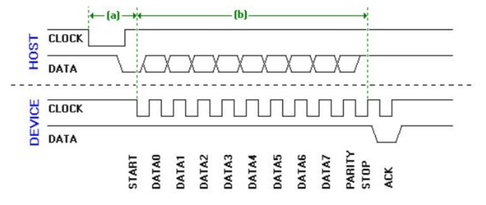

# ps2_mouse
Repositorio grupo de ps2_mouse

## Conexiones fisicas del dispositivo

El ps/2 del mouse consta de un conector de 5 o 6 pines (dependiendo del dispositivo), los cuales asignan 4 pines em ambos casos, y es posible usar un adaptador de uno a otro, o lograr usar algún pin para otro proposito.

Cuando el ratón PS2 envía información, debe enviar tres paquetes de datos consecutivos. Cada paquete contiene información diferente sobre el botón pulsado, el movimiento y la dirección del mismo. La tabla siguiente muestra la información que se envía en cada paquete. Tenga en cuenta que esta información es general y puede variar según el fabricante. Esto se aplica a un ratón de dos botones; la asignación de bits para otros tipos de ratones (de tres botones o con rueda de desplazamiento) es diferente y no se incluye aquí.

## Lista de paquetes de datos e informacion que envia el raton

Cuando el ratón PS2 envía información, debe enviar tres paquetes de datos consecutivos. Cada paquete contiene información diferente sobre el botón pulsado, el movimiento y la dirección del mismo. La tabla siguiente muestra la información que se envía en cada paquete. Tenga en cuenta que esta información es general y puede variar según el fabricante. Esto se aplica a un ratón de dos botones; la asignación de bits para otros tipos de ratones (de tres botones o con rueda de desplazamiento) es diferente y no se incluye aquí.

## Forma de onda

